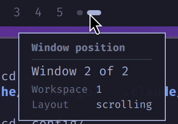

# Window position

A bar widget that shows where the focused window sits in the current
workspace's window list — built for the scrolling layout, but it works under
dwindle and master too since it reads live window geometry rather than
assuming a layout.


One pip per column, left to right in scroll order. The column holding focus
stretches into a pill. A column that stacks several windows splits its pip
into one segment per window, and the focused window's segment is the bright
one — so both the horizontal and vertical position are visible at a glance.


Above: four windows under dwindle, focus on the upper of two windows sharing
the middle column. Three columns, and the middle pip carries a segment per
window with the focused one lit.

Dwindle is the exception. It nests windows instead of lining them up, so a
busy workspace collapses into a couple of columns holding several windows
each, and the segments inside a pip get too thin to read. Once a dwindle
workspace holds more than `maxDwindleWindows` windows the strip is dropped and
the plain `4/9` counter takes over. Scrolling and master are unaffected —
they keep the pips until the column count passes `maxPips`.

The widget is always on the bar. A workspace holding one window shows one
pip; an empty workspace shows a single dim placeholder pip (or `0` in counter
style), so the bar layout never shifts as windows come and go.


- **Hover** for a readout of the position, under the widget's own name and
  over the workspace and layout the reading came from:

  

- **Scroll** over the strip to walk focus along the layout (`u`/`d` on a
  vertical bar).

The bubble is the widget's own `PopupWindow` rather than the bar's shared
tooltip. That tooltip is one line of centred plain text, with nowhere to put a
title or to line values up under each other, so the widget draws its own in the
theme's tooltip colours, on the bar's 400ms open delay, anchored to whichever
face of the bar looks onto the workspace. Drawing it here also keeps it live:
the readout is a binding, so the numbers move under a pointer already resting on
the strip — where the shared tooltip only takes text as it opens, and every
re-announce restarts that 400ms delay, so a widget refreshing several times a
second could never get the bubble open at all.

The readout still funnels through a single string property — a headline, then
a tab-separated label and value per row — for the reason that shaped the old
one. The poller hands back a fresh layout object several times a second, and an
object property would report every one of those as a change and rebuild the rows
under the pointer; a string signals only when the text really differs.

## Settings

Set these on the widget's entry in `~/.config/omarchy/shell.json`, or with
`omarchy bar set davidbrownell.window-position <key> <value>`.

| Key | Default | Meaning |
|---|---|---|
| `style` | `pips` | `pips`, `counter` (a plain `2/5`), or `both` |
| `maxPips` | `12` | Above this many columns, fall back to the counter |
| `maxDwindleWindows` | `6` | Under dwindle only: above this many windows, fall back to the counter |
| `pollInterval` | `250` | Milliseconds between arrangement checks (see below) |

## How it stays current

Hyprland has **no event for a window being repositioned inside a workspace**.
Swapping two columns rewrites every window position and emits nothing but
`windowtitle`/`activewindow` noise:

```
before: [-701] agent   [47] foot-A   [790] foot-B
after:  [-701] agent   [47] foot-B   [790] foot-A
events: (none)
```

Events *do* cover everything that changes which windows are on the workspace
(`openwindow`, `closewindow`, `movewindow`, `workspace`, …), so the
arrangement is the only thing that has to be polled. The widget therefore:

- refreshes immediately, debounced 60ms, on any relevant event — so opening,
  closing and focusing a window is instant;
- refreshes on `Hyprland.focusedWorkspace` changing, rather than relying on the
  raw event to name the workspace: focus moved across monitors arrives as
  `focusedmon`, and the workspace it lands on is only visible in that property;
- polls every `pollInterval` **only while the workspace holds two or more
  tiled windows**, since a single window has no arrangement to change and the
  count itself never changes without an event.

Measured cost of the poll at the 250ms default: below the 10ms scheduler tick
resolution over a 20s sample, i.e. indistinguishable from the poller being off.

The workspace being mapped is the **focused workspace**, not the workspace
owning the focused window. The two part company as soon as you switch to an
empty workspace: nothing there can take focus, so the window you left keeps
`focusHistoryID == 0`, and reading focus first would leave the strip mapping
the workspace you just left. A focused window on some other workspace is
therefore discarded, and the strip falls back to its empty state.

Both geometry and focus are read from a single `hyprctl clients` snapshot,
using `focusHistoryID == 0` for focus rather than `Hyprland.activeToplevel`.
Two reasons: the two can never disagree when they come from the same
snapshot, and `activeToplevel` stays null until an `activewindow` event
arrives — so a freshly started shell would otherwise show no focus at all
until you switched windows.

The layout name comes from the workspace snapshot (`tiledLayout`), refreshed
alongside the clients. It is read per workspace rather than from
`general:layout` because `omarchy-hyprland-workspace-layout-toggle` sets the
layout with a workspace rule, so two workspaces can disagree. That toggle
emits no event this widget listens for, so a layout switch is picked up on the
next poll rather than instantly.

Windows are bucketed into columns by their left edge with a 24px tolerance,
which absorbs the fractional positions Hyprland reports mid-animation.
Floating windows are left out of the strip; while a floating window has focus
the pips dim and no segment is highlighted.

## Editing this widget

Saving a file here makes the shell rescan the plugin registry, but it does
**not** re-instantiate an already-mounted bar widget — the running instance
keeps the old QML. Run `omarchy restart shell` to pick up changes to
`WindowPosition.qml`. (Changes to `shell.json` settings *do* apply on save.)
