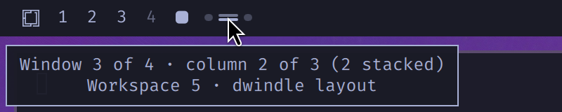

# Window position

A bar widget that shows where the focused window sits in the current
workspace's window list. It reads the live window geometry rather than the
layout's name, so scrolling, dwindle, master and a Lua layout somebody drew
this morning are all mapped the same way.


One pip per column, left to right. The column holding focus stretches into a
pill. A column that stacks several windows splits its pip into one segment per
window, and the focused window's segment is the bright one — so both the
horizontal and vertical position are visible at a glance.


Above: four windows under dwindle, focus on the upper of two windows sharing
the middle column. Three columns, and the middle pip carries a segment per
window with the focused one lit.

A pip is five pixels tall, which is all a stacked column has to divide between
its windows. Past `maxStackedWindows` in one pip the segments cannot be given a
pixel each, so the strip is dropped and the plain `4/9` counter takes over —
however many or few columns the workspace has. The strip is dropped for breadth
too, once the workspace splits into more than `maxPips` columns.

The widget is always on the bar. A workspace holding one window shows one
pip; an empty workspace shows a single dim placeholder pip (or `0` in counter
style), so the bar layout never shifts as windows come and go.


- **Hover** for a readout of the position, under the widget's own name and
  over the workspace and layout the reading came from:

  

- **Scroll** over the strip to walk focus along the layout, one window at a
  time in the order the pips read — across the strip, and down into a pip that
  stacks several windows. Hyprland has no dispatcher for focusing a particular
  window, so each step is a directional push, aimed by where the next window
  actually lies relative to the focused one. The strip does not wrap.

The bubble is the widget's own `PopupWindow` rather than the bar's shared
tooltip. That tooltip is one line of centred plain text, with nowhere to put a
title or to line values up under each other, so the widget draws its own in the
theme's tooltip colours, on the bar's 400ms open delay, anchored to whichever
face of the bar looks onto the workspace. Drawing it here also keeps it live:
the readout is a binding, so the numbers move under a pointer already resting on
the strip — where the shared tooltip only takes text as it opens, and every
re-announce restarts that 400ms delay, so a widget refreshing several times a
second could never get the bubble open at all.

The readout still funnels through a single string property — a headline, then
a tab-separated label and value per row — for the reason that shaped the old
one. The poller hands back a fresh layout object several times a second, and an
object property would report every one of those as a change and rebuild the rows
under the pointer; a string signals only when the text really differs.

## Settings

Set these on the widget's entry in `~/.config/omarchy/shell.json`, or with
`omarchy bar set davidbrownell.window-position <key> <value>`.

| Key | Default | Meaning |
|---|---|---|
| `style` | `pips` | `pips`, `counter` (a plain `2/5`), or `both` |
| `maxPips` | `12` | Above this many columns, fall back to the counter |
| `maxStackedWindows` | `5` | Above this many windows in one pip, fall back to the counter |
| `pollInterval` | `250` | Milliseconds between arrangement checks (see below) |

`maxStackedWindows` replaces the `maxDwindleWindows` of earlier versions, which
counted every window on the workspace but only under dwindle. What makes the
segments unreadable is the depth of one stack, not the total or the layout's
name, so that is what is counted now. The default of `5` keeps the old
behaviour on a dwindle workspace almost exactly.

## Reading the layout

Hyprland 0.55 opened tiling up to Lua, and plugins like
[bjarneo.workspace-layout][wsl] register a layout per shape you draw and hand it
to a workspace with a workspace rule. A workspace can now be running a `25/50/25`
with the overflow stacked into the right-hand column, a grid, or rows instead of
columns — none of which a widget can recognise by name, because the name did not
exist until somebody dragged a divider.

So nothing here is keyed to a layout. A tiling layout is a rectangle cut, and the
pieces cut again, whoever wrote it: scrolling cuts columns, dwindle alternates, a
Lua layout cuts wherever it was drawn to. That means the arrangement can be
recovered from the windows themselves — find a straight line across the workspace
that no window straddles, split there, recurse into each piece — and one pip is
drawn per piece of the first cut, with the windows inside it as its segments.

The first cut is looked for vertically before horizontally, so a shape that reads
either way (a grid, an even split) comes back as columns and the strip keeps its
left-to-right sense. A rows layout has no vertical cut to find, so it comes back
as rows, and the hover readout says `Row 2 of 2` instead of `Column`.


Above: three windows under a rows layout — one across the top, two side by side
below it, and focus on the left of the pair. Two pips for the two rows, the
second carrying a segment per window. The previous model had no way to draw
this. It bucketed windows by their left edge, so it could only ever produce
columns: a rows layout came back as one fat column holding everything, and a
grid as however many of its windows happened to share an `x`.

The 24px tolerance on a cut absorbs the fractional positions Hyprland reports
mid-animation. Floating windows are left out of the strip; while a floating
window has focus the pips dim and no segment is highlighted.

**The layout's name is not shown for a Lua layout, because Hyprland gets it
wrong.** A workspace's `tiledLayout` reports the *first* Lua layout registered
whatever the workspace is actually tiling with, and goes on reporting it after
the layout is changed:

```
rule:     workspace 2, layout lua:omarchy-wsl-focus
geometry: 25 / 50 / 25, five windows stacked in the third column
reported: lua:omarchy-wsl-even
```

The `lua:` prefix is reliable and the name after it is not, so the readout says
`Lua layout` and leaves the description to the `Column`/`Row` line, which is
measured from the windows and cannot be stale. Hyprland's own layout names are
reported correctly and are shown as they come.

[wsl]: https://github.com/bjarneo/omarchy-workspace-layout

## How it stays current

Hyprland has **no event for a window being repositioned inside a workspace**.
Swapping two columns rewrites every window position and emits nothing but
`windowtitle`/`activewindow` noise:

```
before: [-701] agent   [47] foot-A   [790] foot-B
after:  [-701] agent   [47] foot-B   [790] foot-A
events: (none)
```

Events *do* cover everything that changes which windows are on the workspace
(`openwindow`, `closewindow`, `movewindow`, `workspace`, …), so the
arrangement is the only thing that has to be polled. The widget therefore:

- refreshes immediately, debounced 60ms, on any relevant event — so opening,
  closing and focusing a window is instant;
- polls every `pollInterval` **only while some workspace on screen holds two
  or more tiled windows**, since a single window has no arrangement to change
  and the count itself never changes without an event.

Measured cost of the poll at the 250ms default: below the 10ms scheduler tick
resolution over a 20s sample, i.e. indistinguishable from the poller being off.

The workspace being mapped is the one **the monitor is showing**, not the one
owning the focused window. The two part company as soon as you switch to an
empty workspace: nothing there can take focus, so the window you left keeps
`focusHistoryID == 0`, and reading focus first would leave the strip mapping
the workspace you just left. A focused window on some other workspace is
therefore discarded, and the strip falls back to its empty state.

Both geometry and focus are read from a single `hyprctl clients` snapshot,
using `focusHistoryID == 0` for focus rather than `Hyprland.activeToplevel`.
Two reasons: the two can never disagree when they come from the same
snapshot, and `activeToplevel` stays null until an `activewindow` event
arrives — so a freshly started shell would otherwise show no focus at all
until you switched windows.

The layout name comes from the workspace snapshot (`tiledLayout`), refreshed
alongside the clients. It is read per workspace rather than from
`general:layout` because a workspace rule is how both
`omarchy-hyprland-workspace-layout-toggle` and the Lua-layout plugins set one,
so two workspaces can disagree. Neither emits an event this widget listens for,
so a layout switch is picked up on the next poll rather than instantly — though
since the strip is drawn from geometry, it has usually already redrawn itself
by then.

## More than one monitor

A bar surface exists per monitor, so this widget is live once per screen. Each
instance asks its own window which output it is on (`Hyprland.monitorFor`) and
maps the workspace that output is showing, rather than the globally focused
one — otherwise every strip but the one you were looking at would be mapping
somebody else's screen.

Only the monitor holding focus lights a segment. The others draw their
arrangement dim, with nothing highlighted: there is one focused window on the
machine, and claiming otherwise on three screens at once would make the bright
segment mean nothing.

The Hyprland snapshot the strips are drawn from is process-wide, so the
instances do not each fetch it. One is elected to hold the timer, and it hands
the result to the rest with a single broadcast, which keeps the cost of the
poll flat as monitors are added. The election is re-run whenever the set of
instances changes, so unplugging the screen that happened to be holding the
timer passes it to another rather than stopping the strip.

## Editing this widget

Saving a file here makes the shell rescan the plugin registry, but it does
**not** re-instantiate an already-mounted bar widget — the running instance
keeps the old QML. Run `omarchy restart shell` to pick up changes to
`WindowPosition.qml`. (Changes to `shell.json` settings *do* apply on save.)
